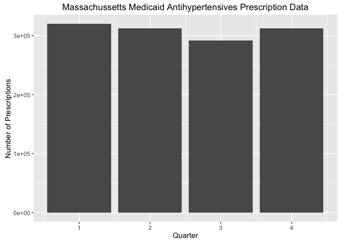

Cold Weather and Antihypertensive Drug Use
================
Manasa Xavier
Jan 3, 2017

In this project, I will compare any correlation cold weather and high blood pressure drug use. <br> Studies have shown the impact of cold temperature increasing the risk for hypertension(HTN), so I wanted to find if there were any patterns to show that more high blood pressure medications were used in cold temperature than warm temperature. <br> To do so, I will CMS Medicaid state utilization data from 2015. I will subset the drug data to antihypertensive medications by comparing the Product Name, given in CMS data, to names of drugs indicated for hypertension. Then to compare usage based on temperature, I will look at the number of prescriptions by quarter. Quarter 1 runs from 1/1 to 3/31, Quarter 2 from 4/1 to 6/30, Quarter 3 from 7/1 to 9/30, and Quarter 4 from 10/1 to 12/31. <br> I will compare number of hypertension prescriptions by quarter for the nation and then for one state to determine any correlation between cold weather/temperature and antihypertensive drug use. <br> <br> **Part1: Obtaining Prescription Data**

Read in Medicaid state utilization data of 2015

``` r
#CMS Medicaid State Utilization Data 2015
url="https://data.medicaid.gov/api/views/ju2h-vcgs/rows.csv?accessType=DOWNLOAD"
cmsdata <- read.csv(url) 
#head(cmsdata)
mycmsdata <- cmsdata
```

<br> Clean data

``` r
#Remove rows with null drug name 
mycmsdata <- cmsdata[!is.na(cmsdata$Product.Name),]
#Remove leading and trailing whitespace from drug name
mycmsdata$Product.Name <- gsub("^\\s+|\\s+$", "", mycmsdata$Product.Name)
#Remove row with blank drug name
mycmsdata <- mycmsdata[!(mycmsdata$Product.Name==""),]
#Drug name to uppercase
mycmsdata$Product.Name <- toupper(mycmsdata$Product.Name)
#Subset first ten characters of drug name
mycmsdata$Product.Name <- substr(mycmsdata$Product.Name, 0, 10)
```

<br> <br> **Part 2: Building a List of Drugs Indicated for Hypertension**

Solution 1: Using openFDA API

Getting generic name of drugs indicated for hypertension from openFDA API

``` r
#Get list of drugs indicated for blood pressure from openFDA API
url = 'https://api.fda.gov/drug/event.json?search=patient.drug.drugindication:hypertension&count=patient.drug.openfda.generic_name.exact&limit=100'
rawdata <- readLines(url, warn="F") 
data <- jsonlite::fromJSON(rawdata)
#head(data)
results <- data$results
bpDrugs <- results$term
```

    ##   [1] "AMBRISENTAN"                                 
    ##   [2] "LISINOPRIL"                                  
    ##   [3] "ASPIRIN"                                     
    ##   [4] "FUROSEMIDE"                                  
    ##   [5] "ASPIRIN 81 MG"                               
    ##   [6] "ASPIRIN 325 MG"                              
    ##   [7] "REGULAR STRENGTH ASPIRIN"                    
    ##   [8] "BOSENTAN"                                    
    ##   [9] "SILDENAFIL CITRATE"                          
    ##  [10] "TREPROSTINIL"                                
    ##  [11] "AMLODIPINE"                                  
    ##  [12] "SIMVASTATIN"                                 
    ##  [13] "METOPROLOL TARTRATE"                         
    ##  [14] "ATENOLOL"                                    
    ##  [15] "METOPROLOL"                                  
    ##  [16] "VALSARTAN"                                   
    ##  [17] "AMLODIPINE BESYLATE"                         
    ##  [18] "LOSARTAN POTASSIUM"                          
    ##  [19] "WARFARIN SODIUM"                             
    ##  [20] "OMEPRAZOLE"                                  
    ##  [21] "HYDROCHLOROTHIAZIDE"                         
    ##  [22] "LEVOTHYROXINE SODIUM"                        
    ##  [23] "TADALAFIL"                                   
    ##  [24] "METFORMIN"                                   
    ##  [25] "CLOPIDOGREL BISULFATE"                       
    ##  [26] "RAMIPRIL"                                    
    ##  [27] "SPIRONOLACTONE"                              
    ##  [28] "PREDNISONE"                                  
    ##  [29] "ERGOCALCIFEROL"                              
    ##  [30] "ROSUVASTATIN CALCIUM"                        
    ##  [31] "WARFARIN"                                    
    ##  [32] "CARVEDILOL"                                  
    ##  [33] "FOLIC ACID"                                  
    ##  [34] "GABAPENTIN"                                  
    ##  [35] "ALLOPURINOL"                                 
    ##  [36] "MACITENTAN"                                  
    ##  [37] "TIOTROPIUM BROMIDE"                          
    ##  [38] "SILDENAFIL"                                  
    ##  [39] "METHOTREXATE SODIUM"                         
    ##  [40] "METHOTREXATE"                                
    ##  [41] "ALPRAZOLAM"                                  
    ##  [42] "PREGABALIN"                                  
    ##  [43] "POTASSIUM CHLORIDE"                          
    ##  [44] "DIGOXIN"                                     
    ##  [45] "SILDINAFIL"                                  
    ##  [46] "ACETAMINOPHEN"                               
    ##  [47] "EPOPROSTENOL SODIUM"                         
    ##  [48] "INSULIN GLARGINE"                            
    ##  [49] "ALBUTEROL SULFATE"                           
    ##  [50] "TELMISARTAN"                                 
    ##  [51] "LANSOPRAZOLE"                                
    ##  [52] "PANTOPRAZOLE"                                
    ##  [53] "ILOPROST"                                    
    ##  [54] "DABIGATRAN ETEXILATE MESYLATE"               
    ##  [55] "METOPROLOL SUCCINATE"                        
    ##  [56] "LORAZEPAM"                                   
    ##  [57] "NIFEDIPINE"                                  
    ##  [58] "OCTINOXATE"                                  
    ##  [59] "CALCIUM"                                     
    ##  [60] "SERTRALINE HYDROCHLORIDE"                    
    ##  [61] "RANITIDINE HYDROCHLORIDE"                    
    ##  [62] "IBUPROFEN"                                   
    ##  [63] "RIVAROXABAN"                                 
    ##  [64] "LEVOTHYROXINE SODIUM ANHYDROUS"              
    ##  [65] "CITALOPRAM HYDROBROMIDE"                     
    ##  [66] "ENALAPRIL MALEATE"                           
    ##  [67] "CLONIDINE HYDROCHLORIDE"                     
    ##  [68] "PANTOPRAZOLE SODIUM"                         
    ##  [69] "CLONIDINE"                                   
    ##  [70] "OMEPRAZOLE MAGNESIUM"                        
    ##  [71] "ALBUTEROL"                                   
    ##  [72] "IRBESARTAN"                                  
    ##  [73] "CARVEDILOL PHOSPHATE"                        
    ##  [74] "CANDESARTAN CILEXETIL"                       
    ##  [75] "CLONAZEPAM"                                  
    ##  [76] "CELECOXIB"                                   
    ##  [77] "ALENDRONATE SODIUM"                          
    ##  [78] "EPOPROSTENOL"                                
    ##  [79] "METFORMIN HYDROCHLORIDE"                     
    ##  [80] "0XYGEN"                                      
    ##  [81] "OXYGEN COMPRESSED"                           
    ##  [82] "OXYGEN"                                      
    ##  [83] "PREDNISOLONE"                                
    ##  [84] "DOXAZOSIN MESYLATE"                          
    ##  [85] "IRON"                                        
    ##  [86] "FLUTICASONE PROPIONATE"                      
    ##  [87] "IBUPROFEN 200MG"                             
    ##  [88] "IBUPROFEN 200 MG"                            
    ##  [89] "DIPHENHYDRAMINE CITRATE, IBUPROFEN"          
    ##  [90] "IBUPFROFEN"                                  
    ##  [91] "GLIPIZIDE"                                   
    ##  [92] "MONTELUKAST SODIUM"                          
    ##  [93] "DILTIAZEM HYDROCHLORIDE"                     
    ##  [94] "ESCITALOPRAM OXALATE"                        
    ##  [95] "ACETAMINOPHEN, DIPHENHYDRAMINE HCL"          
    ##  [96] "TRAMADOL HYDROCHLORIDE TABLETS"              
    ##  [97] "CITALOPRAM"                                  
    ##  [98] "FENOFIBRATE"                                 
    ##  [99] "VENLAFAXINE HYDROCHLORIDE"                   
    ## [100] "BUDESONIDE AND FORMOTEROL FUMARATE DIHYDRATE"

Result - As you can see from the drug list above, openFDA was innacurate as several drugs that are not actually indicated for HTN are were listed

So... <br> Solution 2:

I created my own list of antihypertensive drugs using Micromedex's list of generic drugs that are effective and evidence shows efficacy in treating hypertension and supplemented it with brand names from WebMD's Common Drugs and Medications to treat High Blood Pressure.

Read in data

    ## 'data.frame':    268 obs. of  1 variable:
    ##  $ drug: Factor w/ 267 levels "accupril","accuretic",..: 3 10 11 14 12 15 16 13 18 19 ...

<br> Clean HTN drug names data

``` r
bpDrugs <- mydf$drug
#convert drug names to all uppercase so it is easier to compare with CMS data
BPdrugs <- toupper(bpDrugs)
#take first 10 character substrings of drug names so drug names are same format as CMS data
shortBPdrugs <- substr(BPdrugs, 0, 10)
#remove trailing white space from drug names
bpFinalList <- sub("\\s+$", "", shortBPdrugs)
```

<br> <br>
**Part 3: Data Manipulation**

``` r
#Get prescription data stats for HTN drugs
subdata <- subset(mycmsdata, mycmsdata$Product.Name %in% bpFinalList, select=c(Product.Name, Quarter, State, Units.Reimbursed, Number.of.Prescriptions, Total.Amount.Reimbursed))
#Format relevant data
bpVals <- aggregate(subdata$Number.of.Prescriptions~subdata$Quarter, FUN = function(x) c=sum(x))
totVals <- aggregate(mycmsdata$Number.of.Prescriptions~mycmsdata$Quarter, FUN = function(x) c=sum(x))
names(bpVals) <- c("Quarter", "Num.of.Prescriptions")
names(totVals) <- c("Quarter", "Num.of.Prescriptions")
nonBpVals <- cbind.data.frame(bpVals$Quarter, totVals$Num.of.Prescriptions - bpVals$Num.of.Prescriptions)
names(nonBpVals) <- c("Quarter", "Num.of.Prescriptions")
plotData <- merge(bpVals, nonBpVals, by="Quarter")
names(plotData) <- c("Quarter","BP","nonBP")
total <- merge(plotData, totVals, by="Quarter")
names(total) <- c("Quarter","BP", "nonBP", "Total")

#Find proportion of total drugs written for hypertension
percentage <- round(rbind.data.frame((total$BP[1]/total$Total[1])*100, (total$BP[2]/total$Total[2])*100,(total$BP[3]/total$Total[3])*100, (total$BP[4]/total$Total[4])*100, (total$nonBP[1]/total$Total[1])*100, (total$nonBP[2]/total$Total[2])*100,(total$nonBP[3]/total$Total[3])*100, (total$nonBP[4]/total$Total[4])*100), digits = 2)

#Reformat data to plot
require(reshape)
```

    ## Loading required package: reshape

    ## Warning: package 'reshape' was built under R version 3.2.5

``` r
mdata <- melt(plotData, id=c("Quarter"))
ndata <- cbind(mdata,percentage)
names(ndata) <- c("Quarter", "variable", "value", "percent")
```

<br> <br> **Part 4: Visualizing Data**

Bar plot showing total number of antihypertensive prescriptions per quarter. Note the quarter start dates are - Quarter 1: 1/1, Quarter 2: 4/1, Quarter 3: 7/1, Quarter 4: 10/1

``` r
require(ggplot2)
```

    ## Loading required package: ggplot2

``` r
ggplot(bpVals, aes(x=Quarter, y=Num.of.Prescriptions)) + geom_bar(stat="identity") + ggtitle("National Medicaid Antihypertensives Prescription Data") + labs(x="Quarter", y="Number of Prescriptions")
```


``` r
myPlot <- ggplot() + geom_bar(aes(y = value, x = Quarter, fill=variable), data = ndata,
                                stat="identity") + geom_text(data=ndata, aes(x=Quarter, y=value,label=paste0(percent,"%"), position="stack")) +
  ggtitle("National Medicaid Prescription Data") + labs(x="Quarter", y="Number of Prescriptions")
myPlot
```


The percent of prescriptions for hypertension drugs seems to be similar among all for quarters using national data. However, not all states experience a large decrease in temperatures during winter months. So, I will narrow data and choose one state,Massachussetts, which has much colder temperatures in the winter, to see if there is an increase in antihypertensive use. <br>

``` r
#Subset of only MA state Medicaid utiliztion data for 2015
mycmsdata <- subset(cmsdata,cmsdata$State=="NY", select = c(Product.Name, Quarter, State, Units.Reimbursed, Number.of.Prescriptions, Total.Amount.Reimbursed))
```

I will repeat the data manipulation and visualization steps of the national data to produce plots for MA data. 

**Part 5: Discussion of Results and Further Research**

The plots don't show correlation between cold weather and hypertension. National and MA state trends showed similar proportions of HTN medications filled per quarter.

Improvements to and further research into this topic includes using claims data not limited to Medicare, creating a more complete list of drugs indicated for hypertension. Also since hypertension is a chronic condition, it may be better to use another measure of medication usage than number of prescriptions.

<br> References:

1)Kim J, Jung K, Hong Y, et al. The Relationship between Cold Exposure and Hypertension. J Occup Health 2003; 45:300-6

1.  Bergen P, Fregly MJ, Rossi F, et al. The effect of intermittent exposure to cold on the development of hypertension in the rat. Am J Hypertens 1992;5:548-55

3)Drugs That Treat Hypertension. In Micromedex [online database]. Greenwood Village, CO: Truven Health Analytics (accessed 2017 Jan 3)

4)Common Drugs and Medications to Treat High Blood Pressure. In WebMD. (accessed 2017 Jan 3)

5)The 2014 Drug Trend Report. The Express Scripts Lab. 2015
